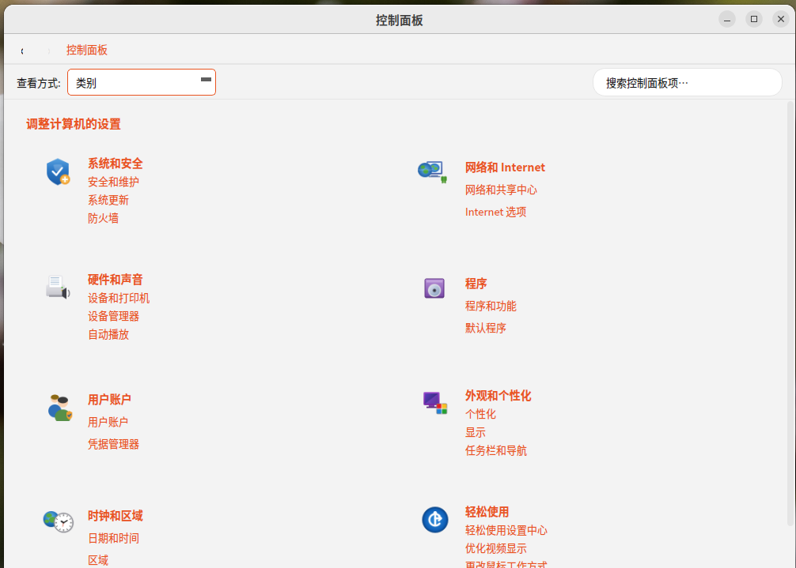

# win11 Control Panel for Linux

> **复刻 Windows 经典控制面板 (Control Panel) 的 Linux 桌面设置中心**

`win11-panel` 是一款使用 PyQt5 编写的桌面设置面板，严格复刻 Windows 7 / Windows 11
**经典控制面板** 的界面与交互（地址栏面包屑、后退/前进、类别主页、大图标/小图标视图、
即时搜索），并通过 Linux 原生命令（`nmcli`、`bluetoothctl`、`pactl`、`xrandr`、
`systemctl`、`timedatectl`、`apt`…）控制真实的系统功能。



---

## 目录

- [特性一览](#特性一览)
- [技术栈](#技术栈)
- [项目结构](#项目结构)
- [架构概览](#架构概览)
- [运行](#运行)
- [构建与打包](#构建与打包)
- [依赖](#依赖)
- [功能页面](#功能页面)
- [设计要点](#设计要点)
- [常见问题](#常见问题)
- [许可与版本](#许可与版本)

---

## 特性一览

| 模块          | 说明                                                                  |
| ------------- | --------------------------------------------------------------------- |
| 经典外壳      | 8 大类别 + 面包屑导航 + 后退/前进 + 查看方式（类别/大图标/小图标/列表） |
| 即时搜索      | 顶部搜索框过滤所有控制面板条目，输入即过滤并自动切换到小图标视图       |
| 18 个设置页面 | 系统、网络、硬件、程序、用户、外观、时钟、辅助等全部到位               |
| 明暗主题      | Win11 Fluent 风格 QSS；自动跟随 GNOME / KDE / XFCE 的明暗模式          |
| 强调色        | 22 种 Win11 内置色板 + 一键跟随系统色                                  |
| 字体缩放      | 75% – 150%，并同步 GNOME `text-scaling-factor`                        |
| 高对比度      | 黑色背景 + 黄色强调色，对应无障碍场景                                  |
| 减少动画      | 关闭开关滑动动画                                                      |
| 系统主题检测  | 读取 `gsettings` / `kreadconfig5|6` / Yaru / 桌面环境自动识别          |
| 真·系统控制   | 通过 nmcli、bluetoothctl、pactl、xrandr、systemctl、apt、ufw、clamav… 实际修改系统配置 |
| 提权          | 涉及管理员操作时通过 `pkexec` 弹出 polkit 图形授权框                   |
| Root 弹窗可取消 | 检测 pkexec 退出码（126/127）并自动回滚开关状态                       |
| .deb 安装     | 一键打包，安装即出现在应用菜单的「设置」分类                          |

---

## 技术栈

- **语言**：Python 3
- **GUI**：PyQt5（`QMainWindow` / `QStackedWidget` / `QScrollArea` / `QPainter` 等）
- **样式**：手写 Fluent 风格 QSS（无 qss 框架，纯模板字符串）
- **图标**：QPainter 代码绘制 + 预渲染 PNG 备份
- **打包**：Debian `dpkg-deb`，Nuitka / PyInstaller **未使用**（保持 100% 可调试）
- **提权**：`pkexec`（polkit），不写 setuid 二进制
- **远程命令**：`subprocess.run` + `QProcess` 异步流（长任务用 `AsyncCommand`）

---

## 项目结构

```
setting/
├── build_deb.sh                     # 一键打包 .deb
├── run.sh                           # 源码运行（开发模式）
├── win11-panel_1.1.0_all.deb        # 已打包的产物（可安装）
├── img/
│   └── 1.png                        # 主页参考截图
├── tools/
│   ├── gen_icons.py                 # 用 QPainter 导出 PNG 图标
│   └── smoke_test.py                # 离屏遍历所有页面 + 主题切换
├── src/                             # 源码（开发目录）
│   ├── main.py                      # 入口
│   ├── main_window.py               # 主窗口：导航、面包屑、类别注册
│   ├── theme.py                     # 主题：QSS 调色板、字体、强调色、系统检测
│   ├── widgets.py                   # 通用控件：开关/卡片/设置行/图标绘制
│   ├── utils.py                     # 系统命令封装 + 信息读取 + AsyncCommand
│   ├── app_icon.py                  # 程序图标（饼图 + 开关 + 滑块）
│   ├── icons/                       # 图标资源
│   │   ├── app/                     # 应用图标 (16/32/48/64/128/256/512)
│   │   ├── classic/                 # 经典控制面板小图标 (32/48)
│   │   ├── mono/                    # 单色图标 (16/20/24/32, dark/light/gray)
│   │   └── tiles/                   # 彩色磁贴 (40/48/64)
│   └── pages/                       # 18 个功能页面
│       ├── display.py               # 显示
│       ├── sound.py                 # 声音
│       ├── notifications.py         # 通知
│       ├── power.py                 # 电源和电池
│       ├── storage.py               # 存储
│       ├── system.py                # 系统信息
│       ├── bluetooth.py             # 蓝牙和其他设备
│       ├── network.py               # 网络和 Internet
│       ├── personalization.py       # 个性化
│       ├── apps.py                  # 应用
│       ├── accounts.py              # 账户
│       ├── time_language.py         # 时间和语言
│       ├── gaming.py                # 游戏
│       ├── privacy.py               # 隐私和安全性
│       ├── update.py                # 软件更新
│       ├── devices.py               # 设备管理器
│       ├── admin.py                 # 管理工具
│       └── accessibility.py         # 辅助功能
└── packaging/
    └── win11-panel/                 # Debian 包布局
        ├── DEBIAN/
        │   ├── control              # 包元数据（版本/依赖）
        │   └── postinst             # 安装后刷新图标缓存
        └── usr/
            ├── bin/
            │   └── win11-panel      # 启动器
            └── share/
                ├── applications/win11-panel.desktop
                └── icons/hicolor/scalable/apps/win11-panel.svg
```

---

## 架构概览

### 分层结构

```
┌────────────────────────────────────────────────────────────┐
│  main.py                  ── 程序入口、QApplication、QSS 注入  │
├────────────────────────────────────────────────────────────┤
│  main_window.py           ── 主窗口外壳：导航、面包屑、注册    │
├────────────────────────────────────────────────────────────┤
│  pages/*.py               ── 18 个功能页面（BasePage 子类）     │
├────────────────────────────────────────────────────────────┤
│  widgets.py               ── 公共控件：开关、卡片、设置行、     │
│                              BasePage、图标绘制 API           │
├────────────────────────────────────────────────────────────┤
│  theme.py                 ── 主题：调色板、QSS、字体、           │
│                              强调色、系统检测、QSettings      │
├────────────────────────────────────────────────────────────┤
│  utils.py                 ── 系统命令/信息读取/pkexec/        │
│                              AsyncCommand                    │
├────────────────────────────────────────────────────────────┤
│  app_icon.py              ── 程序图标生成                     │
├────────────────────────────────────────────────────────────┤
│  Linux 系统命令: nmcli / bluetoothctl / pactl / xrandr / ... │
└────────────────────────────────────────────────────────────┘
```

**调用方向**：上层 → 下层；下层不依赖上层；同层模块互不直接 import。

### 启动流程

```
main.py::main()
  └─ QApplication 初始化（HighDpiPixmaps）
  └─ app.setWindowIcon(build_app_icon(256))
  └─ theme.apply_theme(app)              # QSS 注入 + 调色板
  └─ win = MainWindow()
        ├─ _register_features()          # 实例化所有 page
        └─ navigate(("home",))           # 初始跳转到类别主页
  └─ app.exec_()
```

### 导航协议

页面间跳转通过元组实现：

| 格式               | 含义             |
| ------------------ | ---------------- |
| `("home",)`        | 类别主页         |
| `("all",)`         | 所有控制面板项页 |
| `("cat", cid)`     | 类别详情页       |
| `("item", key)`    | 功能页面         |

历史栈用 `_hist` + `_hist_idx` 实现前进/后退，新导航时截断前进分支。

### 主题系统

- 一份 QSS 模板用 `{accent}` / `{bg}` / `{px(N)}` 占位符动态生成
- 暗色模式自动把低亮度强调色提亮
- 系统主题检测顺序：GNOME gsettings → KDE kreadconfig → Cinnamon → 桌面环境名
- 22 色 Win11 内置强调色板
- 字体堆栈：Segoe UI → Noto Sans CJK SC → WenQuanYi Micro Hei → Ubuntu → sans-serif

### 命令封装层

| 函数          | 说明                                       |
| ------------- | ------------------------------------------ |
| `run()`       | 普通命令，超时 10s，捕获异常               |
| `run_root()`  | 通过 `pkexec` 提权执行；取消时自动提示     |
| `gget/gset()` | gsettings 便捷封装                         |
| `AsyncCommand`| QProcess 异步包装，用于 apt/clamav 等长任务 |

### 公共控件

- **ToggleSwitch**：带滑动动画的开关控件，`set_checked_silent()` 避免回调死循环
- **BasePage**：页面基类，子类实现 `on_show()` 用于进入页面时刷新数据
- **Card / SettingRow**：卡片容器和设置行组件
- **图标 API**：`draw_icon()` 优先加载 PNG，回退到 QPainter 代码绘制

---

## 运行

### 源码直接运行

```bash
cd setting
python3 src/main.py
```

### 安装 .deb

```bash
sudo dpkg -i win11-panel_1.1.0_all.deb
sudo apt -f install        # 自动补齐依赖
win11-panel
```
---

## 构建与打包

### 一键打包

```bash
cd setting
bash build_deb.sh
# 产物: ./win11-panel_<版本>_all.deb
```

### Debian 包结构

安装后源码部署到 `/opt/win11-panel/`，启动脚本部署到 `/usr/bin/win11-panel`，桌面文件部署到 `/usr/share/applications/win11-panel.desktop`。

### 安装与卸载

```bash
# 安装
sudo dpkg -i win11-panel_1.1.0_all.deb
sudo apt-get install -f

# 卸载（保留配置）
sudo dpkg -r win11-panel

# 彻底移除
sudo dpkg --purge win11-panel
```


## 依赖

**必需**：
- `python3` >= 3.6
- `python3-pyqt5`

**推荐**（多数功能需要）：
- `network-manager`（nmcli 网络管理）
- `bluez`（bluetoothctl 蓝牙）
- `pulseaudio-utils`（pactl 声音）
- `policykit-1`（pkexec 授权）
- `x11-xserver-utils`（xrandr 显示）
- `brightnessctl`（亮度）
- `usbutils`（lsusb）
- `pciutils`（lspci）

**可选**：
- `redshift`（夜间模式）
- `clamav` + `clamav-daemon`（病毒扫描）
- `ufw` / `firewalld`（防火墙）
- `powerprofilesctl`（电源模式）
- `cups`（打印机）
- `flameshot` / `gnome-screenshot`（截图工具）

---

## 功能页面

共 18 个功能页面，覆盖系统设置全场景：

| # | 页面 | 文件 | 后端工具 | 说明 |
|---|------|------|----------|------|
| 1 | 显示 | `pages/display.py` | `xrandr`、`brightnessctl`、`redshift` | 亮度、夜间模式、分辨率、方向、缩放 |
| 2 | 声音 | `pages/sound.py` | `pactl`、`paplay` | 输出/输入音量、静音、设备切换、扬声器测试 |
| 3 | 通知 | `pages/notifications.py` | `gsettings`、`QSettings` | 通知开关、勿扰模式、应用级通知控制 |
| 4 | 电源和电池 | `pages/power.py` | `powerprofilesctl`、`systemctl` | 电源模式、屏幕关闭、睡眠、电池状态、关机/重启 |
| 5 | 存储 | `pages/storage.py` | `df`、`lsblk`、`du`、`apt-get` | 磁盘使用、清理建议（apt/journal/回收站）、驱动器预览 |
| 6 | 系统信息 | `pages/system.py` | `uname`、`/proc`、`hostnamectl`、`lspci` | 设备规格、系统信息、重命名电脑 |
| 7 | 蓝牙和其他设备 | `pages/bluetooth.py` | `bluetoothctl`、`rfkill`、`lsusb`、`lpstat` | 蓝牙开关、设备连接/断开、USB、打印机 |
| 8 | 网络和 Internet | `pages/network.py` | `nmcli`、`rfkill` | Wi-Fi 连接、以太网、VPN、代理、飞行模式 |
| 9 | 个性化 | `pages/personalization.py` | `gsettings`、`plasma-apply-*` | 壁纸、浅色/深色主题、22 色强调色、锁屏 |
| 10 | 应用 | `pages/apps.py` | `dpkg`、`flatpak`、`~/.config/autostart` | 已安装应用列表、卸载、启动管理 |
| 11 | 账户 | `pages/accounts.py` | `getent`、`useradd`、`chpasswd`、`gpasswd` | 用户信息、密码修改、添加/删除用户、管理员设置 |
| 12 | 时间和语言 | `pages/time_language.py` | `timedatectl`、`localectl`、`zoneinfo` | 实时时钟、自动时间、时区、语言切换 |
| 13 | 游戏 | `pages/gaming.py` | `powerprofilesctl`、`lsusb` | 游戏模式、游戏平台检测、控制器、截图工具 |
| 14 | 隐私和安全性 | `pages/privacy.py` | `ufw`/`firewalld`、`clamav`、`/sys/firmware/efi` | 防火墙、防病毒扫描、位置/摄像头/麦克风权限、Secure Boot |
| 15 | 软件更新 | `pages/update.py` | `apt-get`、`/var/log/apt/history.log` | 检查更新、全部安装、更新历史、实时输出 |
| 16 | 设备管理器 | `pages/devices.py` | `lspci`、`lsusb`、`lsblk`、`/dev/input` | 设备树（显示/网络/存储/音频/USB等）、设备详情 |
| 17 | 管理工具 | `pages/admin.py` | `systemctl`、`ps`、`kill`、`journalctl`、`crontab` | 服务管理、进程管理、事件查看器、磁盘管理、计划任务 |
| 18 | 辅助功能 | `pages/accessibility.py` | `gsettings`、`pactl` | 文本大小、高对比度、减少动画、光标大小、静音 |

---


## 许可证
- MIT Lincense